# Codifica Analytics - Documento de Arquitetura Técnica

## 1. Architecture design


## 2. Technology Description

* Frontend: React\@18 + tailwindcss\@3 + vite + react-router-dom\@6

* Backend: Supabase (Authentication + Database + Real-time)

* External: Power BI Embedded (Microsoft)

## 3. Route definitions

| Route          | Purpose                                                   |
| -------------- | --------------------------------------------------------- |
| /              | Página inicial, redireciona para login se não autenticado |
| /login         | Página de login para clientes e administradores           |
| /dashboard     | Dashboard do cliente com cards de relatórios disponíveis  |
| /report/:id    | Visualização específica de relatório BI em iframe         |
| /admin         | Painel administrativo com métricas e navegação            |
| /admin/clients | Gerenciamento de clientes (CRUD completo)                 |
| /admin/reports | Gerenciamento de relatórios e associações                 |

## 4. API definitions

### 4.1 Core API

**Autenticação de usuários**

```
POST /auth/v1/token
```

Request:

| Param Name | Param Type | isRequired | Description      |
| ---------- | ---------- | ---------- | ---------------- |
| email      | string     | true       | Email do usuário |
| password   | string     | true       | Senha do usuário |

Response:

| Param Name    | Param Type | Description                  |
| ------------- | ---------- | ---------------------------- |
| access\_token | string     | Token JWT para autenticação  |
| user          | object     | Dados do usuário autenticado |

**Listagem de relatórios do cliente**

```
GET /rest/v1/client_reports
```

Response:

| Param Name | Param Type | Description                                    |
| ---------- | ---------- | ---------------------------------------------- |
| reports    | array      | Lista de relatórios disponíveis para o cliente |

**Gerenciamento de clientes (Admin)**

```
POST /rest/v1/clients
GET /rest/v1/clients
PUT /rest/v1/clients/:id
DELETE /rest/v1/clients/:id
```

## 5. Data model

### 5.1 Data model definition

```mermaid
erDiagram
  USERS ||--o{ CLIENTS : manages
  CLIENTS ||--o{ CLIENT_REPORTS : has
  REPORTS ||--o{ CLIENT_REPORTS : belongs_to
  USERS ||--o{ ACCESS_LOGS : generates

  USERS {
    uuid id PK
    string email
    string password_hash
    string role
    timestamp created_at
    timestamp updated_at
  }
  
  CLIENTS {
    uuid id PK
    string name
    string cnpj
    uuid user_id FK
    boolean is_active
    timestamp created_at
    timestamp updated_at
  }
  
  REPORTS {
    uuid id PK
    string title
    string description
    string power_bi_url
    string iframe_code
    timestamp created_at
    timestamp updated_at
  }
  
  CLIENT_REPORTS {
    uuid id PK
    uuid client_id FK
    uuid report_id FK
    timestamp created_at
  }
  
  ACCESS_LOGS {
    uuid id PK
    uuid user_id FK
    uuid report_id FK
    timestamp accessed_at
    string ip_address
  }
```



### 5.2 Data Definition Language

**Tabela de Usuários (users)**

```sql
-- Criar tabela de usuários
CREATE TABLE users (
  id UUID PRIMARY KEY DEFAULT gen_random_uuid(),
  email VARCHAR(255) UNIQUE NOT NULL,
  password_hash VARCHAR(255) NOT NULL,
  role VARCHAR(20) DEFAULT 'client' CHECK (role IN ('client', 'admin')),
  created_at TIMESTAMP WITH TIME ZONE DEFAULT NOW(),
  updated_at TIMESTAMP WITH TIME ZONE DEFAULT NOW()
);

-- Criar índices
CREATE INDEX idx_users_email ON users(email);
CREATE INDEX idx_users_role ON users(role);

-- Políticas RLS
ALTER TABLE users ENABLE ROW LEVEL SECURITY;
CREATE POLICY "Users can view own data" ON users FOR SELECT USING (auth.uid() = id);
CREATE POLICY "Admins can view all users" ON users FOR SELECT USING (auth.jwt() ->> 'role' = 'admin');

-- Permissões
GRANT SELECT ON users TO authenticated;
GRANT ALL PRIVILEGES ON users TO service_role;
```

**Tabela de Clientes (clients)**

```sql
-- Criar tabela de clientes
CREATE TABLE clients (
  id UUID PRIMARY KEY DEFAULT gen_random_uuid(),
  name VARCHAR(255) NOT NULL,
  cnpj VARCHAR(18) UNIQUE NOT NULL,
  user_id UUID REFERENCES users(id) ON DELETE CASCADE,
  is_active BOOLEAN DEFAULT true,
  created_at TIMESTAMP WITH TIME ZONE DEFAULT NOW(),
  updated_at TIMESTAMP WITH TIME ZONE DEFAULT NOW()
);

-- Criar índices
CREATE INDEX idx_clients_user_id ON clients(user_id);
CREATE INDEX idx_clients_cnpj ON clients(cnpj);
CREATE INDEX idx_clients_active ON clients(is_active);

-- Políticas RLS
ALTER TABLE clients ENABLE ROW LEVEL SECURITY;
CREATE POLICY "Clients can view own data" ON clients FOR SELECT USING (user_id = auth.uid());
CREATE POLICY "Admins can manage all clients" ON clients FOR ALL USING (auth.jwt() ->> 'role' = 'admin');

-- Permissões
GRANT SELECT ON clients TO authenticated;
GRANT ALL PRIVILEGES ON clients TO service_role;
```

**Tabela de Relatórios (reports)**

```sql
-- Criar tabela de relatórios
CREATE TABLE reports (
  id UUID PRIMARY KEY DEFAULT gen_random_uuid(),
  title VARCHAR(255) NOT NULL,
  description TEXT,
  power_bi_url TEXT NOT NULL,
  iframe_code TEXT NOT NULL,
  created_at TIMESTAMP WITH TIME ZONE DEFAULT NOW(),
  updated_at TIMESTAMP WITH TIME ZONE DEFAULT NOW()
);

-- Criar índices
CREATE INDEX idx_reports_title ON reports(title);

-- Políticas RLS
ALTER TABLE reports ENABLE ROW LEVEL SECURITY;
CREATE POLICY "Authenticated users can view reports" ON reports FOR SELECT TO authenticated USING (true);
CREATE POLICY "Admins can manage reports" ON reports FOR ALL USING (auth.jwt() ->> 'role' = 'admin');

-- Permissões
GRANT SELECT ON reports TO authenticated;
GRANT ALL PRIVILEGES ON reports TO service_role;
```

**Tabela de Associação Cliente-Relatório (client\_reports)**

```sql
-- Criar tabela de associação
CREATE TABLE client_reports (
  id UUID PRIMARY KEY DEFAULT gen_random_uuid(),
  client_id UUID REFERENCES clients(id) ON DELETE CASCADE,
  report_id UUID REFERENCES reports(id) ON DELETE CASCADE,
  created_at TIMESTAMP WITH TIME ZONE DEFAULT NOW(),
  UNIQUE(client_id, report_id)
);

-- Criar índices
CREATE INDEX idx_client_reports_client_id ON client_reports(client_id);
CREATE INDEX idx_client_reports_report_id ON client_reports(report_id);

-- Políticas RLS
ALTER TABLE client_reports ENABLE ROW LEVEL SECURITY;
CREATE POLICY "Users can view own client reports" ON client_reports FOR SELECT USING (
  client_id IN (SELECT id FROM clients WHERE user_id = auth.uid())
);
CREATE POLICY "Admins can manage all associations" ON client_reports FOR ALL USING (auth.jwt() ->> 'role' = 'admin');

-- Permissões
GRANT SELECT ON client_reports TO authenticated;
GRANT ALL PRIVILEGES ON client_reports TO service_role;
```

**Tabela de Logs de Acesso (access\_logs)**

```sql
-- Criar tabela de logs
CREATE TABLE access_logs (
  id UUID PRIMARY KEY DEFAULT gen_random_uuid(),
  user_id UUID REFERENCES users(id) ON DELETE SET NULL,
  report_id UUID REFERENCES reports(id) ON DELETE SET NULL,
  accessed_at TIMESTAMP WITH TIME ZONE DEFAULT NOW(),
  ip_address INET
);

-- Criar índices
CREATE INDEX idx_access_logs_user_id ON access_logs(user_id);
CREATE INDEX idx_access_logs_report_id ON access_logs(report_id);
CREATE INDEX idx_access_logs_accessed_at ON access_logs(accessed_at DESC);

-- Políticas RLS
ALTER TABLE access_logs ENABLE ROW LEVEL SECURITY;
CREATE POLICY "Users can view own logs" ON access_logs FOR SELECT USING (user_id = auth.uid());
CREATE POLICY "Admins can view all logs" ON access_logs FOR SELECT USING (auth.jwt() ->> 'role' = 'admin');
CREATE POLICY "Authenticated users can insert logs" ON access_logs FOR INSERT TO authenticated WITH CHECK (user_id = auth.uid());

-- Permissões
GRANT SELECT, INSERT ON access_logs TO authenticated;
GRANT ALL PRIVILEGES ON access_logs TO service_role;
```

**Dados Iniciais**

```sql
-- Inserir usuário administrador padrão
INSERT INTO auth.users (id, email, encrypted_password, email_confirmed_at, created_at, updated_at, raw_app_meta_data, raw_user_meta_data)
VALUES (
  gen_random_uuid(),
  'admin@codifica.com',
  crypt('admin123', gen_salt('bf')),
  NOW(),
  NOW(),
  NOW(),
  '{"provider": "email", "providers": ["email"]}',
  '{"role": "admin"}'
);

-- Inserir relatório de exemplo
INSERT INTO reports (title, description, power_bi_url, iframe_code)
VALUES (
  'Dashboard SDP Pneus',
  'Relatório de vendas e performance da SDP Pneus',
  'https://app.powerbi.com/view?r=eyJrIjoiNmM3OWMzZjktOTg4Zi00Zjk4LTg4OWUtMTU3MGQxYzBmMTdkIiwidCI6ImI1NzkyZTcyLWM3YzgtNDJjNS1hYTNmLTI0Nzc4NTJhZDVhYyJ9',
  '<iframe title="dash_sdpneus" width="600" height="373.5" src="https://app.powerbi.com/view?r=eyJrIjoiNmM3OWMzZjktOTg4Zi00Zjk4LTg4OWUtMTU3MGQxYzBmMTdkIiwidCI6ImI1NzkyZTcyLWM3YzgtNDJjNS1hYTNmLTI0Nzc4NTJhZDVhYyJ9" frameborder="0" allowFullScreen="true"></iframe>'
);
```

