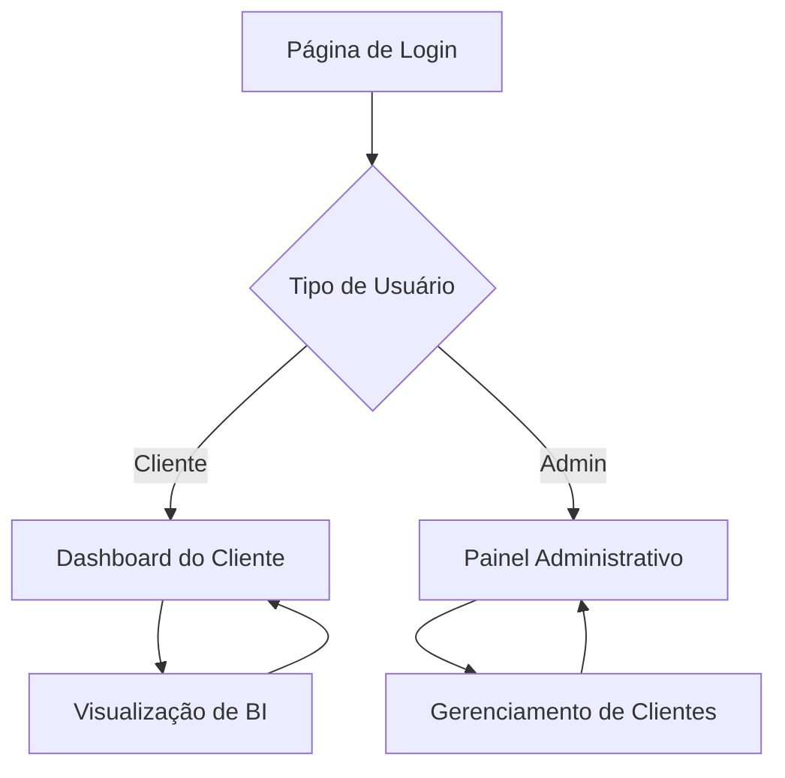

# Codifica Analytics - Documento de Requisitos do Produto

## 1. Product Overview
O Codifica Analytics é uma aplicação web que fornece acesso seguro aos clientes para visualização de seus relatórios de Business Intelligence (BI) através de uma interface moderna e intuitiva.
- A plataforma resolve o problema de distribuição e acesso controlado a dashboards de BI, permitindo que clientes visualizem seus relatórios específicos de forma organizada e segura.
- O produto visa simplificar o processo de compartilhamento de insights de dados, aumentando o valor percebido pelos clientes e otimizando a gestão de relatórios.

## 2. Core Features

### 2.1 User Roles
| Role | Registration Method | Core Permissions |
|------|---------------------|------------------|
| Cliente | Credenciais fornecidas pelo administrador | Visualizar relatórios de BI associados ao seu perfil |
| Administrador | Acesso direto com credenciais de sistema | Gerenciar clientes, relatórios e monitorar acessos |

### 2.2 Feature Module
Nossa aplicação Codifica Analytics consiste nas seguintes páginas principais:
1. **Página de Login**: autenticação de usuários, redirecionamento baseado em perfil.
2. **Dashboard do Cliente**: cards de relatórios disponíveis, navegação intuitiva.
3. **Visualização de BI**: iframe do Power BI, controles de visualização.
4. **Painel Administrativo**: listagem de clientes, métricas de acesso.
5. **Gerenciamento de Clientes**: CRUD completo, associação de relatórios.

### 2.3 Page Details
| Page Name | Module Name | Feature description |
|-----------|-------------|---------------------|
| Página de Login | Formulário de Autenticação | Validar credenciais, identificar tipo de usuário, redirecionar para área apropriada |
| Dashboard do Cliente | Grid de Relatórios | Exibir cards com relatórios disponíveis, filtros por categoria, busca por nome |
| Visualização de BI | Iframe do Power BI | Renderizar relatório em iframe responsivo, controles de tela cheia, botão voltar |
| Painel Administrativo | Dashboard de Métricas | Mostrar estatísticas de acesso, gráficos de uso, lista de clientes ativos |
| Gerenciamento de Clientes | CRUD de Clientes | Criar, editar, excluir clientes, associar relatórios, bloquear/desbloquear acesso |

## 3. Core Process

**Fluxo do Cliente:**
O cliente acessa a página de login, insere suas credenciais e é redirecionado para seu dashboard pessoal. No dashboard, visualiza cards dos relatórios disponíveis e clica em um card para abrir o relatório em uma nova página com iframe do Power BI.

**Fluxo do Administrador:**
O administrador faz login e acessa o painel administrativo com métricas gerais. Pode navegar para o gerenciamento de clientes para criar novos usuários, editar informações existentes, associar relatórios específicos ou bloquear acessos conforme necessário.

## 4. User Interface Design

### 4.1 Design Style
- **Cores primárias**: Azul escuro (#1e293b) e cinza neutro (#64748b)
- **Cores secundárias**: Branco (#ffffff) e cinza claro (#f1f5f9)
- **Estilo de botões**: Arredondados com sombra sutil e efeitos hover
- **Fonte**: Inter ou system fonts, tamanhos 14px-24px
- **Layout**: Card-based com navegação superior fixa
- **Ícones**: Lucide React ou Heroicons para consistência moderna

### 4.2 Page Design Overview
| Page Name | Module Name | UI Elements |
|-----------|-------------|-------------|
| Página de Login | Formulário Central | Card centralizado, campos com bordas arredondadas, botão principal azul, fundo gradiente sutil |
| Dashboard do Cliente | Grid Responsivo | Cards com sombra, hover effects, ícones coloridos, layout 3 colunas desktop/1 coluna mobile |
| Visualização de BI | Container Full-width | Iframe responsivo, header com breadcrumb, botão voltar estilizado |
| Painel Administrativo | Layout Dashboard | Métricas em cards, gráficos com cores neutras, tabela com zebra striping |
| Gerenciamento de Clientes | Formulário + Tabela | Modal para edição, botões de ação coloridos, campos de formulário organizados |

### 4.3 Responsiveness
A aplicação é mobile-first com adaptação para desktop, incluindo otimização para touch em dispositivos móveis e tablets. O layout utiliza CSS Grid e Flexbox para responsividade fluida.